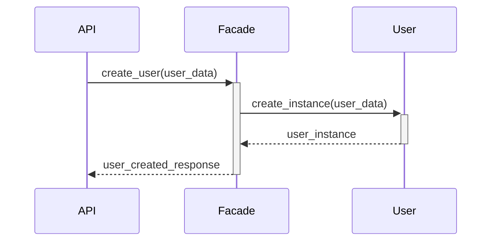

# Project Setup and Package Initialization

## Context

Before diving into the implementation of the business logic and API endpoints, it's essential to have **a well-organized project structure**. A **clear** and **modular** organization will help maintain the codebase, make it easier to integrate new features, and **ensure that your application is scalable**.

Additionally, to simplify the implementation, you are provided with the **complete in-memory repository code**.

## In this task, you will

1. Set up the structure for the Presentation, Business Logic, and Persistence layers, creating the necessary folders, packages, and files.
2. Prepare the project to use the Facade pattern for communication between layers.
3. Implement the in-memory repository to handle object storage and validation.
4. Plan for future integration of the Persistence layer, even though it won't be fully implemented in this part.

Although the Persistence layer will be fully implemented in Part 3, this task includes the implementation of the in-memory repository. This repository will later be replaced by a database-backed solution in Part 3.

## Instructions

1. **Create the Project Directory Structure**:

    Your project should be organized into the following structure:

    ```text
    hbnb/
    ├── app/
    │   ├── __init__.py
    │   ├── api/
    │   │   ├── __init__.py
    │   │   ├── v1/
    │   │       ├── __init__.py
    │   │       ├── users.py
    │   │       ├── places.py
    │   │       ├── reviews.py
    │   │       ├── amenities.py
    │   ├── models/
    │   │   ├── __init__.py
    │   │   ├── user.py
    │   │   ├── place.py
    │   │   ├── review.py
    │   │   ├── amenity.py
    │   ├── services/
    │   │   ├── __init__.py
    │   │   ├── facade.py
    │   ├── persistence/
    │       ├── __init__.py
    │       ├── repository.py
    ├── run.py
    ├── config.py
    ├── requirements.txt
    ├── README.md
    ```

    **Explanation:**

    - The `app/` directory contains the core application code.
    - The `api/` subdirectory houses the API endpoints, organized by version (`v1/`).
    - The `models/` subdirectory contains the business logic classes (e.g., `user.py`, `place.py`).
    - The `services/` subdirectory is where the Facade pattern is implemented, managing the interaction between layers.
    - The `persistence/` subdirectory is where the in-memory repository is implemented. This will later be replaced by a database-backed solution using SQL Alchemy.
    - `run.py` is the entry point for running the Flask application.
    - `config.py` will be used for configuring environment variables and application settings.
    - `requirements.txt` will list all the Python packages needed for the project.
    - `README.md` will contain a brief overview of the project.

2. **Initialize Python Packages**

    In each directory that is intended to be a Python package (e.g., `app/`, `api/`, `models/`, `services/`, `persistence/`, `v1/`), create an empty `__init__.py` file. This tells Python to treat these directories as importable packages.

3. **Set Up the Flask Application with Placeholders**

    Inside the `app/` directory, create the Flask application instance within the `__init__.py` file:

    ```python
    from flask import Flask
    from flask_restx import Api

    def create_app():
        app = Flask(__name__)
        api = Api(app, version='1.0', title='HBnB API', description='HBnB Application API')

        # Placeholder for API namespaces (endpoints will be added later)
        # Additional namespaces for places, reviews, and amenities will be added later

        return app
    ```

4. **Implement the In-Memory Repository**

    The in-memory repository will handle object storage and validation. It follows a consistent interface that will later be replaced by a database-backed repository.

    **Create the following structure under the `persistence/` directory:**

    ```text
    hbnb/
    ├── app/
    │   ├── persistence/
    │       ├── __init__.py
    │       ├── repository.py
    ```

    **Inside `repository.py`, the in-memory repository and interface will be fully implemented:**

    ```python
    from abc import ABC, abstractmethod

    class Repository(ABC):
        @abstractmethod
        def add(self, obj):
            pass

        @abstractmethod
        def get(self, obj_id):
            pass

        @abstractmethod
        def get_all(self):
            pass

        @abstractmethod
        def update(self, obj_id, data):
            pass

        @abstractmethod
        def delete(self, obj_id):
            pass

        @abstractmethod
        def get_by_attribute(self, attr_name, attr_value):
            pass


    class InMemoryRepository(Repository):
        def __init__(self):
            self._storage = {}

        def add(self, obj):
            self._storage[obj.id] = obj

        def get(self, obj_id):
            return self._storage.get(obj_id)

        def get_all(self):
            return list(self._storage.values())

        def update(self, obj_id, data):
            obj = self.get(obj_id)
            if obj:
                obj.update(data)

        def delete(self, obj_id):
            if obj_id in self._storage:
                del self._storage[obj_id]

        def get_by_attribute(self, attr_name, attr_value):
            return next((obj for obj in self._storage.values() if getattr(obj, attr_name) == attr_value), None)
    ```

5. **Plan for the Facade Pattern with Placeholders**

    In the `services/` subdirectory, create a `facade.py` file where you will define the `HBnBFacade` class. This class will handle communication between the Presentation, Business Logic, and Persistence layers. You will interact with the repositories (like the in-memory repository) through this Class:

    ```python
    from app.persistence.repository import InMemoryRepository

    class HBnBFacade:
        def __init__(self):
            self.user_repo = InMemoryRepository()
            self.place_repo = InMemoryRepository()
            self.review_repo = InMemoryRepository()
            self.amenity_repo = InMemoryRepository()

        # Placeholder method for creating a user
        def create_user(self, user_data):
            # Logic will be implemented in later tasks
            pass

        # Placeholder method for fetching a place by ID
        def get_place(self, place_id):
            # Logic will be implemented in later tasks
            pass
    ```

    The methods in the Facade use placeholders to avoid errors during initial testing. The actual logic will be added in future tasks.

6. **Create the Entry Point**

    In the root directory, create the `run.py` file that will serve as the entry point for running the application:

    ```python
    from app import create_app

    app = create_app()

    if __name__ == '__main__':
        app.run(debug=True)
    ```

7. **Prepare the Configuration**

    In the root directory, create a `config.py` file where you can define environment-specific settings. For now, you can start with a basic configuration:

    ```python
    import os

    class Config:
        SECRET_KEY = os.getenv('SECRET_KEY', 'default_secret_key')
        DEBUG = False

    class DevelopmentConfig(Config):
        DEBUG = True

    config = {
        'development': DevelopmentConfig,
        'default': DevelopmentConfig
    }
    ```

    You'll enhance this file as needed in later stages of the project.

8. **Document the Project Setup**

    In the `README.md` file, write a brief overview of the project setup:
    - Describe the purpose of each directory and file.
    - Include instructions on how to install dependencies and run the application.

9. **Install Required Packages**

    In the `requirements.txt` file, list the Python packages needed for the project:

    ```text
    flask
    flask-restx
    ```

    Install the dependencies using:

    ```bash
    pip install -r requirements.txt
    ```

10. **Test the Initial Setup**

    Run the application to ensure everything is set up correctly:

    ```bash
    python run.py
    ```

    You should see the Flask application running, although no routes are functional yet. This confirms that the project structure and basic setup are correct and ready for further development.

## Expected Outcome

By the end of this task, you'll have a well-organized, modular project structure with clear separation of concerns across the Presentation, Business Logic, and Persistence layers. The Flask application will be functional, with an in-memory repository and Facade pattern in place, ready for future integration of API endpoints and a database-backed persistence layer.

### Resources

- [**Flask Documentation**](https://flask.palletsprojects.com/)
- [**Flask-RESTx Documentation**](https://flask-restx.readthedocs.io/)
- [**Python Project Structure Best Practices**](https://docs.python-guide.org/writing/structure/)
- [**Facade Design Pattern in Python**](https://refactoring.guru/design-patterns/facade/python/example)

# Implement Core Business Logic Classes

## Context

In Part 1, students designed the Business Logic layer, including defining entities and relationships. This task requires you to implement those designs while adhering to best practices for modular, maintainable code. You may have already created base classes with common attributes (e.g., `id`, `created_at`, and `updated_at`) to be inherited by concrete classes such as `User`, `Place`, `Review`, and `Amenity`.

## Why UUIDs Are Used as Identifiers

In the HBnB application, each object is identified by a universally unique identifier (UUID) instead of a sequential numeric ID. Here’s why:

1. **Global Uniqueness:** UUIDs are guaranteed to be unique across different systems and databases. This allows for distributed systems and ensures that IDs don’t clash when combining data from multiple sources.
2. **Security Considerations:** Sequential numeric IDs can reveal information about the system, such as the total number of users or entities. UUIDs are non-sequential and harder to predict, adding a layer of security by preventing malicious users from easily guessing valid IDs.
3. **Scalability and Flexibility:** UUIDs support systems that need to scale across multiple servers or regions. The decentralized generation of UUIDs ensures no conflict when data is merged or moved across systems.

For a deeper dive into why UUIDs are preferable in certain scenarios, you can refer to this article: [What are UUIDs, and are they better than regular IDs?](https://blog.boot.dev/clean-code/what-are-uuids-and-should-you-use-them/)

## Objective

In this task, you will:

1. **Implement the Classes**: Develop the core business logic classes for User, Place, Review, and Amenity based on your Part 1 design.

2. **Ensure Relationships**: Correctly implement the relationships between entities (e.g., User to Review, Place to Amenity, etc).

3. **Handle Attribute Validation and Updates**: Validate attributes and manage updates as per the defined requirements.

## Instructions

### Class guidelines before Implementation

Each class should include the following attributes, with appropriate types and value restrictions:

- **User Class:**

  - `id` (String): Unique identifier for each user.
  - `first_name` (String): The first name of the user. Required, maximum length of 50 characters.
  - `last_name` (String): The last name of the user. Required, maximum length of 50 characters.
  - `email` (String): The email address of the user. Required, must be unique, and should follow standard email format validation.
  - `is_admin` (Boolean): Indicates whether the user has administrative privileges. Defaults to `False`.
  - `created_at` (DateTime): Timestamp when the user is created.
  - `updated_at` (DateTime): Timestamp when the user is last updated.

- **Place Class:**

  - `id` (String): Unique identifier for each place.
  - `title` (String): The title of the place. Required, maximum length of 100 characters.
  - `description` (String): Detailed description of the place. Optional.
  - `price` (Float): The price per night for the place. Must be a positive value.
  - `latitude` (Float): Latitude coordinate for the place location. Must be within the range of -90.0 to 90.0.
  - `longitude` (Float): Longitude coordinate for the place location. Must be within the range of -180.0 to 180.0.
  - `owner` (User): `User` instance of who owns the place. This should be validated to ensure the owner exists.
  - `created_at` (DateTime): Timestamp when the place is created.
  - `updated_at` (DateTime): Timestamp when the place is last updated.

- **Review Class:**

  - `id` (String): Unique identifier for each review.
  - `text` (String): The content of the review. Required.
  - `rating` (Integer): Rating given to the place, must be between 1 and 5.
  - `place` (Place): `Place` instance being reviewed. Must be validated to ensure the place exists.
  - `user` (User): `User` instance of who wrote the review. Must be validated to ensure the user exists.
  - `created_at` (DateTime): Timestamp when the review is created.
  - `updated_at` (DateTime): Timestamp when the review is last updated.

- **Amenity Class:**

  - `id` (String): Unique identifier for each amenity.
  - `name` (String): The name of the amenity (e.g., "Wi-Fi", "Parking"). Required, maximum length of 50 characters.
  - `created_at` (DateTime): Timestamp when the amenity is created.
  - `updated_at` (DateTime): Timestamp when the amenity is last updated.

### Implementation Steps

1. **Implementing Classes, UUID, Created_at, and Updated_at Attributes**

    Each class should include:

    - A UUID identifier for each instance (`id = str(uuid.uuid4())`).
    - Timestamps for creation (`created_at`) and modification (`updated_at`).
    - The `created_at` timestamp should be set when an object is created, and the `updated_at` timestamp should be updated every time the object is modified.

    - Example base class for handling common attributes:

    ```python
    import uuid
    from datetime import datetime

    class BaseModel:
        def __init__(self):
            self.id = str(uuid.uuid4())
            self.created_at = datetime.now()
            self.updated_at = datetime.now()

        def save(self):
            """Update the updated_at timestamp whenever the object is modified"""
            self.updated_at = datetime.now()

        def update(self, data):
            """Update the attributes of the object based on the provided dictionary"""
            for key, value in data.items():
                if hasattr(self, key):
                    setattr(self, key, value)
            self.save()  # Update the updated_at timestamp
    ```

    - In this example we store the `UUID` generated as a `String` to avoid problems when retrieving from the Memory Repository.
    - Methods should be implemented to handle core operations, such as creating, updating, and retrieving instances. For instance, `save` methods to update timestamps and validate input data according to the constraints listed. The `update` method should allow updating object attributes based on a dictionary of new values.

    In the `models/` directory, implement the classes defined in your design:

    - `user.py`
    - `place.py`
    - `review.py`
    - `amenity.py`

    If you have created base classes in Part 1 (e.g., a base class for shared attributes like `id`, `created_at`, and `updated_at`), ensure that your entity classes inherit from them.

2. **Implement Relationships Between Entities**

    - Define relationships between the classes as follows:

    **User and Place:**

    - A `User` can own multiple `Place` instances (`one-to-many` relationship).
    - The `Place` class should include an attribute `owner`, referencing the `User` who owns it.

    **Place and Review:**

    - A `Place` can have multiple `Review` instances (`one-to-many` relationship).
    - The `Review` class should include attributes `place` and `user`, referencing the `Place` being reviewed and the `User` who wrote the review, respectively.

    **Place and Amenity:**

    - A `Place` can have multiple `Amenity` instances (`many-to-many` relationship).
    - This relationship can be represented using a list of amenities within the `Place` class. For simplicity, in-memory storage or a list of amenity IDs can be used.

    - Example of implementing relationships:

    ```python
    class Place(BaseModel):
        def __init__(self, title, description, price, latitude, longitude, owner):
            super().__init__()
            self.title = title
            self.description = description
            self.price = price
            self.latitude = latitude
            self.longitude = longitude
            self.owner = owner
            self.reviews = []  # List to store related reviews
            self.amenities = []  # List to store related amenities

        def add_review(self, review):
            """Add a review to the place."""
            self.reviews.append(review)

        def add_amenity(self, amenity):
            """Add an amenity to the place."""
            self.amenities.append(amenity)
    ```

    - Implement methods for managing these relationships, like adding a review to a place, or listing amenities associated with a place. Ensure that these operations validate the existence of related entities to maintain data integrity.

3. **Test the Core Classes Independently**

    Before moving on to the API implementation, write simple tests to validate that the classes are functioning as expected. Ensure that relationships between entities (e.g., adding a review to a place) work correctly.

   ### Example Tests

    Here’s a basic guide on how to test your implementation:

    **Testing the User Class**

    ```python
    from app.models.user import User

    def test_user_creation():
        user = User(first_name="John", last_name="Doe", email="john.doe@example.com")
        assert user.first_name == "John"
        assert user.last_name == "Doe"
        assert user.email == "john.doe@example.com"
        assert user.is_admin is False  # Default value
        print("User creation test passed!")

    test_user_creation()
    ```

    **Testing the Place Class with Relationships**

    ```python
    from app.models.place import Place
    from app.models.user import User
    from app.models.review import Review

    def test_place_creation():
        owner = User(first_name="Alice", last_name="Smith", email="alice.smith@example.com")
        place = Place(title="Cozy Apartment", description="A nice place to stay", price=100, latitude=37.7749, longitude=-122.4194, owner=owner)

        # Adding a review
        review = Review(text="Great stay!", rating=5, place=place, user=owner)
        place.add_review(review)

        assert place.title == "Cozy Apartment"
        assert place.price == 100
        assert len(place.reviews) == 1
        assert place.reviews[0].text == "Great stay!"
        print("Place creation and relationship test passed!")

    test_place_creation()
    ```

    **Testing the Amenity Class**

    ```python
    from app.models.amenity import Amenity

    def test_amenity_creation():
        amenity = Amenity(name="Wi-Fi")
        assert amenity.name == "Wi-Fi"
        print("Amenity creation test passed!")

    test_amenity_creation()
    ```

4. **Document the Implementation**
    - Update the `README.md` file to include information about the Business Logic layer, describing the entities and their responsibilities.
    - Include examples of how the classes and methods can be used.

## Expected Outcome

By the end of this task, you should have fully implemented core business logic classes (User, Place, Review, Amenity) with the appropriate attributes, methods, and relationships. With these components in place, you will be ready to proceed to implementing the API endpoints in the next task. The implemented classes should support the necessary validation, relationships, and data integrity checks required for the application’s core functionality. Additionally, the relationships between entities should be fully operational, allowing seamless interactions like linking reviews to places or associating amenities with places.

With this solid foundation in place, the business logic will be prepared for further integration with the Presentation and Persistence layers in subsequent tasks.

### Resources

- [**Python OOP Basics**](https://realpython.com/python3-object-oriented-programming/)
- [**Designing Classes and Relationships**](https://docs.python.org/3/tutorial/classes.html)
- [**Why You Should Use UUIDs**](https://datatracker.ietf.org/doc/html/rfc4122)


# Implement the User Endpoints

## Context

This task involves setting up the endpoints to handle CRUD operations (Create, Read, Update) for users, while ensuring integration with the Business Logic layer via the Facade pattern. The `DELETE` operation will **not** be implemented for users in this part of the project.

The API interface, return format, and status codes must be clearly defined since it **must follow the standard RESTful API conventions**.

## Objective

In this task, the full implementation for user creation (POST) and retrieval (GET) by ID is provided as a guide. You will be responsible for implementing the retrieval of the list of users (GET /api/v1/users/) and updating user information (PUT /api/v1/users/<user_id>)

1. Set up the `POST`, `GET`, and `PUT` endpoints for managing users.
2. Implement the logic for handling user-related operations in the Business Logic layer.
3. Integrate the Presentation layer (API) and Business Logic layer through the Facade.

## Instructions: Detailed Guide to get you started

### Implement the Business Logic Layer

The Facade methods should be connected to the repository and models implemented in Task 2. Update `services/facade.py` with the following methods:

```python
class HBnBFacade:
    def __init__(self):
        self.user_repo = InMemoryRepository()

    def create_user(self, user_data):
        user = User(**user_data)
        self.user_repo.add(user)
        return user

    def get_user(self, user_id):
        return self.user_repo.get(user_id)

    def get_user_by_email(self, email):
        return self.user_repo.get_by_attribute('email', email)
```

### Implement the User Endpoints in the Presentation Layer (API)

Create the `api/v1/users.py` file and include the following code:

```python
from flask_restx import Namespace, Resource, fields
from app.services.facade import HBnBFacade

api = Namespace('users', description='User operations')

# Define the user model for input validation and documentation
user_model = api.model('User', {
    'first_name': fields.String(required=True, description='First name of the user'),
    'last_name': fields.String(required=True, description='Last name of the user'),
    'email': fields.String(required=True, description='Email of the user')
})

facade = HBnBFacade()

@api.route('/')
class UserList(Resource):
    @api.expect(user_model, validate=True)
    @api.response(201, 'User successfully created')
    @api.response(400, 'Email already registered')
    @api.response(400, 'Invalid input data')
    def post(self):
        """Register a new user"""
        user_data = api.payload

        # Simulate email uniqueness check (to be replaced by real validation with persistence)
        existing_user = facade.get_user_by_email(user_data['email'])
        if existing_user:
            return {'error': 'Email already registered'}, 400

        new_user = facade.create_user(user_data)
        return {'id': new_user.id, 'first_name': new_user.first_name, 'last_name': new_user.last_name, 'email': new_user.email}, 201
```

- `POST /api/v1/users/`: Registers a new user and performs a check for email uniqueness.

**Explanation:**

- The `POST` endpoint registers a new user and performs a check for email uniqueness.
- If the email is already registered, the API returns a 400 status code with an error message.
- If input data is missing or invalid, a 400 status code is returned with a relevant error message **by the framework** thanks to the `validate=True` parameter.
- The Facade handles all interactions between layers.

### Implementation for User Retrieval by ID (GET /api/v1/users/<user_id>)

Continue in the `api/v1/users.py` file and include this additional code:

```python
@api.route('/<user_id>')
class UserResource(Resource):
    @api.response(200, 'User details retrieved successfully')
    @api.response(404, 'User not found')
    def get(self, user_id):
        """Get user details by ID"""
        user = facade.get_user(user_id)
        if not user:
            return {'error': 'User not found'}, 404
        return {'id': user.id, 'first_name': user.first_name, 'last_name': user.last_name, 'email': user.email}, 200
```

- `GET /api/v1/users/<user_id>`: Retrieves user details by ID.

**Explanation:**

- The `GET` endpoint retrieves user details by ID.
- If the user does not exist, the API returns a 404 status code with an error message.

### Set Up the Namespace in `app/__init__.py`

Before implementing the endpoints, ensure that the users namespace is correctly registered in the application. Update the `app/__init__.py` file as follows:

```python
from flask import Flask
from flask_restx import Api
from app.api.v1.users import api as users_ns

def create_app():
    app = Flask(__name__)
    api = Api(app, version='1.0', title='HBnB API', description='HBnB Application API')

    # Register the users namespace
    api.add_namespace(users_ns, path='/api/v1/users')
    return app
```

This code registers the users namespace, allowing the routes defined in `api/v1/users.py` to be accessible through `/api/v1/users`.

Try running the application to ensure that the user registration and retrieval endpoints are working as expected.

## Input and Output Formats, Status Codes

Once the endpoints are implemented, use tools like Postman or cURL to test each operation.

For example, you can use the following cURL command to create a new user:

```bash
curl -X POST http://localhost:5000/api/v1/users/ \
  -H "Content-Type: application/json" \
  -d '{"first_name": "John", "last_name": "Doe", "email": "john.doe@example.com"}'
```

or use the following cURL command to retrieve a user by ID:

```bash
curl -X GET http://localhost:5000/api/v1/users/<user_id>
```

For each endpoint, you must ensure that the input format, output format, and status codes are consistent and clearly defined:

### Test the Provided Endpoints

Ensure that the provided endpoints are working as expected:

#### Create a User (POST /api/v1/users/)

```http
POST /api/v1/users/
Content-Type: application/json

{
  "first_name": "John",
  "last_name": "Doe",
  "email": "john.doe@example.com"
}
```

Expected Response:

```jsonc
{
  "id": "3fa85f64-5717-4562-b3fc-2c963f66afa6",
  "first_name": "John",
  "last_name": "Doe",
  "email": "john.doe@example.com"
}

// 201 Created
```

Possible Status Codes:

- 201 Created: When the user is successfully created.
- 400 Bad Request: If the email is already registered or input data is invalid.

#### Retrieve a User by ID (GET /api/v1/users/<user_id>)

```http
GET /api/v1/users/<user_id>
Content-Type: application/json
```

Expected Response:

```jsonc
{
  "id": "3fa85f64-5717-4562-b3fc-2c963f66afa6",
  "first_name": "John",
  "last_name": "Doe",
  "email": "john.doe@x.com"
}

// 200 OK
```

Possible Status Codes:

- `200 OK`: When the user is successfully retrieved.
- `404 Not Found`: If the user does not exist.

> Now you should have working services to create and retrieve users.

Complete the task by finishing the other endpoints for User management.

### Testing your endpoints

Ensure that your endpoints are working as expected. Here are some examples:

#### Retrieve a List of Users (GET /api/v1/users/)

```http
GET /api/v1/users/
Content-Type: application/json
```

Expected Response:

```jsonc
[
  {
    "id": "3fa85f64-5717-4562-b3fc-2c963f66afa6",
    "first_name": "John",
    "last_name": "Doe",
    "email": "john.doe@example.com"
  },
  ...
]

// 200 OK
```

Possible Status Codes:

- `200 OK`: When the list of users is successfully retrieved.

#### Update a User (PUT /api/v1/users/<user_id>)

```http
PUT /api/v1/users/<user_id>
Content-Type: application/json

{
  "first_name": "Jane",
  "last_name": "Doe",
  "email": "jane.doe@example.com"
}
```

Expected Response:

```jsonc
{
  "id": "3fa85f64-5717-4562-b3fc-2c963f66afa6",
  "first_name": "Jane",
  "last_name": "Doe",
  "email": "jane.doe@example.com"
}

// 200 OK
```

Possible Status Codes:

- 200 OK: When the user is successfully updated.
- 404 Not Found: If the user does not exist.
- 400 Bad Request: If input data is invalid.

## Sequence Diagram: Visualizing the Flow of User Registration



This diagram shows the interaction between the API, Facade, and Business Logic layer when registering a new user.

## Expected Outcome

By the end of this task, you should have fully implemented the core user management endpoints, including the ability to create, read, and update users. The provided implementation guide for the user registration endpoint should serve as a model for implementing the remaining user endpoints as well as endpoints for other entities (e.g., Place, Review, Amenity).

The functionality should be documented and tested, ensuring that all user-related operations are handled smoothly within the HBnB application.

## Resources

1. [**Flask-RESTx Documentation**](https://flask-restx.readthedocs.io/)
2. [**Testing REST APIs with cURL**](https://everything.curl.dev/)
3. [**Designing RESTful APIs**](https://restfulapi.net/)


# Implement the Amenity Endpoints

## Context

This task involves setting up the endpoints to handle CRUD operations (Create, Read, Update) for amenities, while ensuring integration with the Business Logic layer via the Facade pattern. The `DELETE` operation will **not** be implemented for amenities in this part of the project.

## In this task, you will

1. Set up the `POST`, `GET`, and `PUT` endpoints for managing amenities.
2. Implement the necessary logic for handling amenity-related operations in the Business Logic layer.
3. Integrate the Presentation layer (API) and Business Logic layer through the Facade.

## Instructions: Detailed Guide to get you started

### Implement the Business Logic Layer

In the `models/amenity.py` file, the `Amenity` class should have already been implemented in Task 2.

Update the `HBnBFacade` class in the `services/facade.py` file, adding the following methods:

```python
def create_amenity(self, amenity_data):
    # Placeholder for logic to create an amenity
    pass

def get_amenity(self, amenity_id):
    # Placeholder for logic to retrieve an amenity by ID
    pass

def get_all_amenities(self):
    # Placeholder for logic to retrieve all amenities
    pass

def update_amenity(self, amenity_id, amenity_data):
    # Placeholder for logic to update an amenity
    pass
```

These methods manage the creation, retrieval, and updating of amenities within the Business Logic layer. You will need to fill in the logic that handles interactions with the repository and implements necessary validation.

### Implement the Amenity Endpoints in the Presentation Layer (API)

Create the `api/v1/amenities.py` file, then define the routes and create the skeleton methods for these endpoints. Use the placeholders provided below to get started.

```python
from flask_restx import Namespace, Resource, fields
from app.services.facade import HBnBFacade

api = Namespace('amenities', description='Amenity operations')

# Define the amenity model for input validation and documentation
amenity_model = api.model('Amenity', {
    'name': fields.String(required=True, description='Name of the amenity')
})

facade = HBnBFacade()

@api.route('/')
class AmenityList(Resource):
    @api.expect(amenity_model)
    @api.response(201, 'Amenity successfully created')
    @api.response(400, 'Invalid input data')
    def post(self):
        """Register a new amenity"""
        # Placeholder for the logic to register a new amenity
        pass

    @api.response(200, 'List of amenities retrieved successfully')
    def get(self):
        """Retrieve a list of all amenities"""
        # Placeholder for logic to return a list of all amenities
        pass

@api.route('/<amenity_id>')
class AmenityResource(Resource):
    @api.response(200, 'Amenity details retrieved successfully')
    @api.response(404, 'Amenity not found')
    def get(self, amenity_id):
        """Get amenity details by ID"""
        # Placeholder for the logic to retrieve an amenity by ID
        pass

    @api.expect(amenity_model)
    @api.response(200, 'Amenity updated successfully')
    @api.response(404, 'Amenity not found')
    @api.response(400, 'Invalid input data')
    def put(self, amenity_id):
        """Update an amenity's information"""
        # Placeholder for the logic to update an amenity by ID
        pass
```

- `POST /api/v1/amenities/`: Register a new amenity.
- `GET /api/v1/amenities/`: Retrieve a list of all amenities.
- `GET /api/v1/amenities/<amenity_id>`: Get amenity details by ID.
- `PUT /api/v1/amenities/<amenity_id>`: Update an amenity's information.

**Explanation:**

- The `POST` endpoint handles the creation of a new amenity, while the `GET` endpoints manage retrieval, both for a single amenity and a list of all amenities. The `PUT` endpoint is responsible for updating an existing amenity’s details.
- The placeholders give you a foundation to build on, while you will need to implement the logic based on previous examples like the user registration task.

> [!IMPORTANT]
> **Remember to register the namespace and API documentation for the amenity endpoints in the `api/__init__.py` file.**

## Input and Output Formats, Status Codes

For each endpoint, ensure that the input format, output format, and status codes are consistent and clearly defined.

### Test the Provided Endpoints

Once the endpoints are implemented, use tools like Postman or cURL to test each operation.
Ensure that your endpoints are working as expected. Here are some examples:

#### Register a New Amenity (POST /api/v1/amenities/)

```http
POST /api/v1/amenities/
Content-Type: application/json

{
  "name": "Wi-Fi"
}
```

Expected Response:

```jsonc
{
  "id": "1fa85f64-5717-4562-b3fc-2c963f66afa6",
  "name": "Wi-Fi"
}

// 201 Created
```

Possible Status Codes:

- 201 Created: When the amenity is successfully created.
- 400 Bad Request: If input data is invalid.

#### Retrieve All Amenities (GET /api/v1/amenities/)

```http
GET /api/v1/amenities/
Content-Type: application/json
```

Expected Response:

```jsonc
[
  {
    "id": "1fa85f64-5717-4562-b3fc-2c963f66afa6",
    "name": "Wi-Fi"
  },
  {
    "id": "2fa85f64-5717-4562-b3fc-2c963f66afa6",
    "name": "Air Conditioning"
  }
]

// 200 OK
```

Possible Status Codes:

- 200 OK: List of amenities retrieved successfully.

#### Retrieve an Amenity’s Details (GET /api/v1/amenities/<amenity_id>)

```http
GET /api/v1/amenities/<amenity_id>
Content-Type: application/json
```

Expected Response:

```jsonc
{
  "id": "1fa85f64-5717-4562-b3fc-2c963f66afa6",
  "name": "Wi-Fi"
}

// 200 OK
```

Possible Status Codes:

- 200 OK: When the amenity is successfully retrieved.
- 404 Not Found: If the amenity does not exist.

#### Update an Amenity’s Information (PUT /api/v1/amenities/<amenity_id>)

```http
PUT /api/v1/amenities/<amenity_id>
Content-Type: application/json

{
  "name": "Air Conditioning"
}
```

Expected Response:

```jsonc
{
  "message": "Amenity updated successfully"
}

// 200 OK
```

Possible Status Codes:

- 200 OK: When the amenity is successfully updated.
- 404 Not Found: If the amenity does not exist.
- 400 Bad Request: If input data is invalid.

## Expected Outcome

By the end of this task, you should have fully implemented the core amenity management endpoints, including the ability to create, read, and update amenities. The functionality should be documented and tested, ensuring that all amenity-related operations are handled smoothly within the HBnB application.

## Resources

- [**Flask-RESTx Documentation**](https://flask-restx.readthedocs.io/)
- [**Testing REST APIs with cURL**](https://everything.curl.dev/)
- [**Designing RESTful APIs**](https://restfulapi.net/)