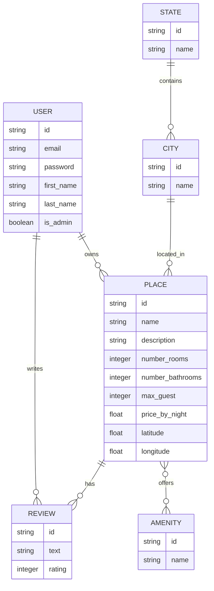

# HBNB Project

## Description
HBNB is a complete web application composed of:
- A RESTful API
- A MySQL database
- A command interpreter for data management

## Installation
```bash
pip install -r requirements.txt
```

## Usage
### API
```bash
python run.py
```

### Console
```bash
./console.py
```

## Testing
```bash
python -m unittest discover tests
```
```mermaid
erDiagram
    User {
        string id PK "UUID"
        string first_name
        string last_name
        string email
        string password
        boolean is_admin
        datetime created_at
        datetime updated_at
    }

    Place {
        string id PK "UUID"
        string title
        text description
        decimal price
        float latitude
        float longitude
        string owner_id FK
        datetime created_at
        datetime updated_at
    }

    Review {
        string id PK "UUID"
        text text
        int rating "1-5"
        string user_id FK
        string place_id FK
        datetime created_at
        datetime updated_at
    }

    Amenity {
        string id PK "UUID"
        string name
        datetime created_at
        datetime updated_at
    }

    PlaceAmenity {
        string place_id FK
        string amenity_id FK
    }

    User ||--o{ Place : owns
    User ||--o{ Review : writes
    Place ||--o{ Review : has
    Place ||--o{ PlaceAmenity : has
    Amenity ||--o{ PlaceAmenity : included_in


# HBnB Project - Part 3: Enhanced Backend with Authentication and Database Integration

## Table of Contents
1. [Introduction](#introduction)
2. [Project Objectives](#project-objectives)
3. [Learning Outcomes](#learning-outcomes)
4. [Project Structure](#project-structure)
5. [Setup and Installation](#setup-and-installation)
6. [Key Components](#key-components)
7. [Database Schema](#database-schema)
8. [API Endpoints](#api-endpoints)
9. [Authentication and Authorization](#authentication-and-authorization)
10. [Testing](#testing)
11. [Deployment](#deployment)
12. [Contributing](#contributing)
13. [License](#license)

## Introduction

Welcome to Part 3 of the HBnB Project! This phase focuses on enhancing the backend with robust authentication, authorization, and database integration. We transition from in-memory storage to SQLite for development and prepare for MySQL in production environments.

## Project Objectives

- Implement JWT-based authentication
- Enforce role-based access control
- Integrate SQLite database using SQLAlchemy ORM
- Design and visualize the database schema
- Ensure data consistency and validation
- Prepare for MySQL integration in production

## Learning Outcomes

By completing this part, you will gain proficiency in:

- Securing APIs with JWT authentication
- Implementing role-based access control
- Working with SQLAlchemy ORM for database operations
- Designing relational database schemas
- Transitioning from development to production database environments

## Project Structure

```
hbnb/
├── api/
│   └── v1/
│       ├── views/
│       └── app.py
├── models/
│   ├── engine/
│   │   └── db_storage.py
│   ├── amenity.py
│   ├── base_model.py
│   ├── city.py
│   ├── place.py
│   ├── review.py
│   ├── state.py
│   └── user.py
├── tests/
├── config.py
├── requirements.txt
└── README.md
```

## Setup and Installation

1. Clone the repository:
   ```
   git clone https://github.com/your-repo/hbnb.git
   cd hbnb
   ```

2. Set up a virtual environment:
   ```
   python3 -m venv venv
   source venv/bin/activate
   ```

3. Install dependencies:
   ```
   pip install -r requirements.txt
   ```

4. Set up the database:
   ```
   flask db upgrade
   ```

5. Run the application:
   ```
   flask run
   ```

## Key Components

### User Model
```python
class User(BaseModel, Base):
    __tablename__ = 'users'
    email = Column(String(128), nullable=False, unique=True)
    password = Column(String(128), nullable=False)
    first_name = Column(String(128), nullable=True)
    last_name = Column(String(128), nullable=True)
    is_admin = Column(Boolean, default=False)
```

### Authentication
We use Flask-JWT-Extended for JWT-based authentication:

```python
from flask_jwt_extended import create_access_token

@app.route('/login', methods=['POST'])
def login():
    email = request.json.get('email', None)
    password = request.json.get('password', None)
    user = User.query.filter_by(email=email).first()
    if user and check_password_hash(user.password, password):
        access_token = create_access_token(identity=email)
        return jsonify(access_token=access_token), 200
    return jsonify({"msg": "Bad username or password"}), 401
```

## Database Schema



## API Endpoints
```

| Method | Endpoint                    | Description           |
|--------|-----------------------------|-----------------------|
| POST   | /api/v1/auth/login          | User login            |
| GET    | /api/v1/users               | List all users        |
| POST   | /api/v1/users               | Create a new user     |
| GET    | /api/v1/users/<user_id>     | Get a specific user   |
| PUT    | /api/v1/users/<user_id>     | Update a user         |
| DELETE | /api/v1/users/<user_id>     | Delete a user         |
| GET    | /api/v1/places              | List all places       |
| POST   | /api/v1/places              | Create a new place    |
| GET    | /api/v1/places/<place_id>   | Get a specific place  |
| PUT    | /api/v1/places/<place_id>   | Update a place        |
| DELETE | /api/v1/places/<place_id>   | Delete a place        |
```


Citations:
[1] https://ppl-ai-file-upload.s3.amazonaws.com/web/direct-files/29334386/e7bef791-f890-4463-b2b4-79d6db1118ce/paste.txt
## Authentication and Authorization

We use JWT tokens for authentication. To access protected routes, include the JWT token in the Authorization header:

```
Authorization: Bearer <your_jwt_token>
```

Role-based access control is implemented using the `is_admin` field in the User model.

## Testing

Run the test suite using:

```
python -m unittest discover tests
```

## Deployment

For production deployment:

1. Update `config.py` with MySQL database credentials.
2. Set the `FLASK_ENV` environment variable to `production`.
3. Use a production-grade WSGI server like Gunicorn.

## Contributing

We welcome contributions! Please see our [Contributing Guidelines](CONTRIBUTING.md) for more details.

## License

This project is licensed under the MIT License - see the [LICENSE](LICENSE) file for details.

---

Created by Arinhasvatj KEOPHIPHATH (9295@holbertonstudents.com)

© 2024 HBnB Project. All rights reserved.

Citations:
[1] https://ppl-ai-file-upload.s3.amazonaws.com/web/direct-files/29334386/e7bef791-f890-4463-b2b4-79d6db1118ce/paste.txt
[2] https://github.com/Holberton-Uy/hbnb-doc/tree/main/part3