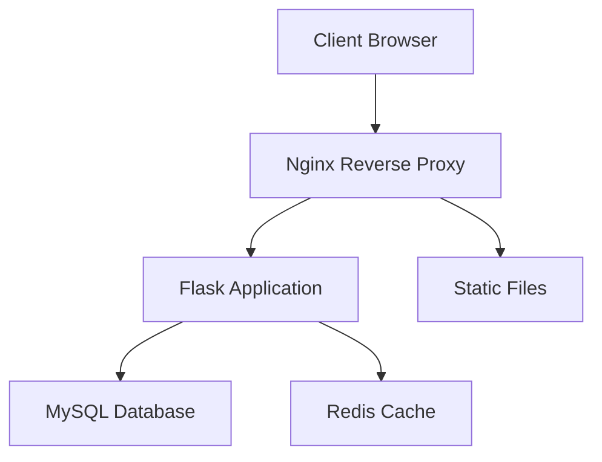
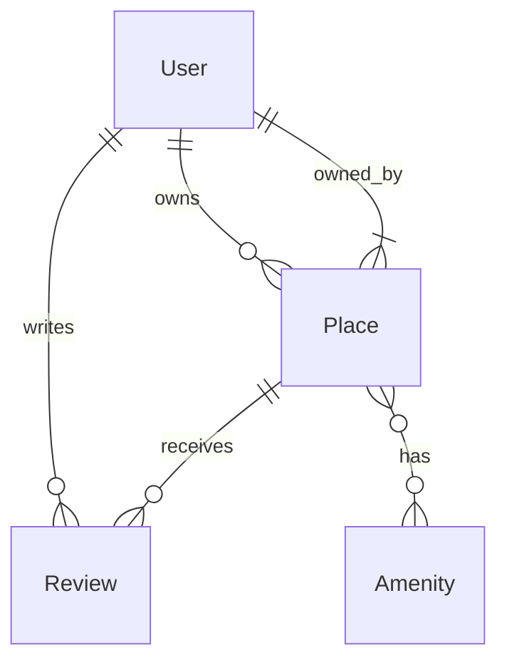

# 🛠 Documentation Technique HBNB 


## 📑 Table des Matières

1. [Architecture Système](#architecture-système)
2. [Structure du Code](#structure-du-code)
3. [Modèles de Données](#modèles-de-données)
4. [API RESTful](#api-restful)
5. [Base de Données](#base-de-données)
6. [Sécurité](#sécurité)
7. [Monitoring](#monitoring)
8. [Performance](#performance)

## 🏗 Architecture Système

### Vue d'ensemble


### Composants Principaux
| Composant | Version | Description | Port |
|-----------|---------|-------------|------|
| Nginx | 1.21+ | Reverse proxy, SSL termination | 80, 443 |
| Flask | 2.0.1 | Application web framework | 5000 |
| MySQL | 8.0 | Base de données principale | 3306 |
| Redis | 6.2 | Cache et sessions | 6379 |
| Prometheus | 2.30 | Monitoring metrics | 9090 |
| Grafana | 8.0 | Visualisation metrics | 3000 |

### Flow de Données
1. **Requête Client** → Nginx
2. **Nginx** → Route vers Flask ou Fichiers Statiques
3. **Flask** → Traitement Business Logic
4. **SQLAlchemy** → Interactions Base de Données

## 📁 Structure du Code

```plaintext
hbnb/
├── app/
│   ├── __init__.py          # Application Factory
│   ├── models/              # Modèles SQLAlchemy
│   │   ├── __init__.py
│   │   ├── base_model.py    # Classe de Base
│   │   ├── user.py         # Modèle Utilisateur
│   │   ├── place.py        # Modèle Logement
│   │   ├── review.py       # Modèle Avis
│   │   └── amenity.py      # Modèle Équipements
│   ├── api/                # Routes API
│   │   ├── __init__.py
│   │   ├── auth.py        # Authentification
│   │   ├── users.py       # Endpoints Utilisateurs
│   │   └── places.py      # Endpoints Logements
│   ├── services/          # Logique Métier
│   └── utils/            # Utilitaires
├── config/
│   ├── __init__.py
│   ├── development.py
│   └── production.py
└── tests/
    ├── unit/
    ├── integration/
    └── load/
```

Oui exactement, c'est le début du fichier TECHNICAL.md. Je continue dans le même fichier avec les modèles de données et leurs relations.

```markdown
## 🗃 Modèles de Données

### Diagramme de Relations


### Détails des Modèles

#### 🧑 User
```python
# Définition et spécifications techniques
class User(BaseModel):
    __tablename__ = 'users'
    
    # Attributs Requis
    email: str(120)       # Unique, Indexé
    password: str(255)    # Hashé avec bcrypt
    first_name: str(100)  # Non-nullable
    last_name: str(100)   # Non-nullable
    is_admin: bool        # Default: False
    
    # Relations
    places → Place       # One-to-Many
    reviews → Review     # One-to-Many
    
    # Indexes
    - idx_user_email (UNIQUE)
    - idx_user_name (first_name, last_name)
```

#### 🏠 Place
```python
class Place(BaseModel):
    __tablename__ = 'places'
    
    # Attributs Essentiels
    title: str(255)        # Non-nullable, Indexé
    description: text      # Nullable
    price: Decimal(10,2)   # Non-nullable
    latitude: Float        # Nullable
    longitude: Float       # Nullable
    
    # Clés Étrangères
    owner_id → User.id     # CASCADE on delete
    
    # Relations
    owner → User          # Many-to-One
    amenities → Amenity   # Many-to-Many
    reviews → Review      # One-to-Many
    
    # Indexes
    - idx_place_location (latitude, longitude)
    - idx_place_price
```

### 🔒 Contraintes et Validations

#### Règles Métier
1. **User**
   ```python
   def validate_email(self):
       if not re.match(r'^[\w\.-]+@[\w\.-]+\.\w+$', self.email):
           raise ValueError("Invalid email format")
   ```

2. **Place**
   ```python
   def validate_price(self):
       if self.price <= 0:
           raise ValueError("Price must be positive")
       if self.price > 1000000:
           raise ValueError("Price exceeds maximum allowed")
   ```

### 🔄 Migrations Base de Données

```bash
# Structure des migrations
migrations/
├── versions/
│   ├── 001_initial_schema.py
│   ├── 002_add_user_indexes.py
│   └── 003_add_place_constraints.py
```

#### Commandes Essentielles
```bash
# Créer une nouvelle migration
flask db migrate -m "description"

# Appliquer les migrations
flask db upgrade

# Rollback
flask db downgrade
```

```markdown
## 🌐 API RESTful

### Standards & Conventions

#### 📡 Format des Réponses
```json
{
    "status": "success|error",
    "data": {
        // Données de réponse
    },
    "message": "Message descriptif",
    "timestamp": "2024-11-14T12:00:00Z"
}
```

### 🔑 Endpoints Authentification

#### POST /api/v1/auth/register
```http
POST /api/v1/auth/register
Content-Type: application/json

{
    "email": "user@example.com",
    "password": "SecurePass123!",
    "first_name": "John",
    "last_name": "Doe"
}

# Réponse Succès (201 Created)
{
    "status": "success",
    "data": {
        "id": "uuid-string",
        "email": "user@example.com",
        "first_name": "John",
        "created_at": "2024-11-14T12:00:00Z"
    }
}
```

### 🏠 Endpoints Places

#### GET /api/v1/places
```http
# Paramètres de requête
price_min: float       # Prix minimum
price_max: float       # Prix maximum
location: string       # Ville ou coordonnées
amenities: string[]    # Liste d'équipements
page: int             # Numéro de page
per_page: int         # Éléments par page

# Exemple de réponse
{
    "status": "success",
    "data": {
        "items": [...],
        "total": 100,
        "page": 1,
        "per_page": 20,
        "pages": 5
    }
}
```

## 🔒 Sécurité

### Authentification & Autorisation

#### 🔐 JWT Configuration
```python
JWT_CONFIG = {
    'algorithm': 'HS256',
    'expires_in': 3600,  # 1 heure
    'refresh_expires_in': 604800  # 7 jours
}
```

#### 🛡️ Middleware de Sécurité
```python
@app.before_request
def security_middleware():
    # Rate Limiting
    if not rate_limiter.is_allowed(request.remote_addr):
        abort(429)
    
    # CORS Verification
    if not is_cors_allowed(request.origin):
        abort(403)
```

### 🔍 Validation des Données

#### Exemple avec Place
```python
class PlaceSchema(Schema):
    title = fields.Str(required=True, validate=[
        Length(min=3, max=255),
        Regexp(r'^[\w\s-]+$')
    ])
    price = fields.Float(required=True, validate=[
        Range(min=0, max=1000000)
    ])
    latitude = fields.Float(validate=[
        Range(min=-90, max=90)
    ])
```

## 📊 Monitoring & Performance

### Métriques Prometheus

#### 🎯 Métriques Clés
```python
METRICS = {
    'http_requests_total': Counter(
        'http_requests_total',
        'Total HTTP requests',
        ['method', 'endpoint', 'status']
    ),
    'response_time_seconds': Histogram(
        'response_time_seconds',
        'Response time in seconds',
        buckets=[0.1, 0.5, 1.0, 2.0, 5.0]
    )
}
```

### 📈 Dashboard Grafana

#### Panels Principaux
1. **Performances API**
   - Temps de réponse moyen
   - Requêtes par seconde
   - Taux d'erreur

2. **Base de Données**
   - Connexions actives
   - Temps de requête
   - Ratio cache hits/misses

3. **Ressources Système**
   - CPU Usage
   - Mémoire
   - I/O Disque

### 🚀 Optimisations

#### Cache Strategy
```python
CACHE_CONFIG = {
    'CACHE_TYPE': 'redis',
    'CACHE_REDIS_URL': 'redis://redis:6379/0',
    'CACHE_DEFAULT_TIMEOUT': 300
}

# Exemple d'utilisation
@cache.cached(timeout=300, key_prefix='all_places')
def get_all_places():
    return Place.query.all()
```

#### Index Database
```sql
-- Index composites pour recherches fréquentes
CREATE INDEX idx_place_search 
ON places (price, latitude, longitude);

-- Index full-text pour recherche
CREATE FULLTEXT INDEX idx_place_search_text
ON places (title, description);
```

## 📦 Déploiement

### 🐳 Configuration Docker Production

```yaml
# docker-compose.prod.yml
version: '3.8'
services:
  web:
    build: 
      context: .
      dockerfile: Dockerfile.prod
    environment:
      - FLASK_ENV=production
      - DATABASE_URL=${DATABASE_URL}
    deploy:
      replicas: 3
      resources:
        limits:
          cpus: '0.50'
          memory: 512M
```

### 🔄 CI/CD Pipeline
```yaml
name: Deploy Production

on:
  push:
    branches: [main]

jobs:
  deploy:
    runs-on: ubuntu-latest
    steps:
      - name: Tests
        run: pytest
      
      - name: Build & Push
        run: |
          docker build -t hbnb:${{ github.sha }}
          docker push hbnb:${{ github.sha }}
      
      - name: Deploy
        uses: digitalocean/action-doctl@v2
```

## 🔧 Maintenance

### Backups
```bash
#!/bin/bash
# backup.sh
DATE=$(date +%Y%m%d_%H%M%S)
mysqldump -u $DB_USER -p$DB_PASS $DB_NAME > backup_$DATE.sql
gzip backup_$DATE.sql
aws s3 cp backup_$DATE.sql.gz s3://backups/
```

### Monitoring Alerts
```yaml
# alertmanager.yml
receivers:
  - name: 'team-emails'
    email_configs:
      - to: 'team@example.com'
        send_resolved: true

route:
  receiver: 'team-emails'
  group_wait: 30s
  group_interval: 5m
  repeat_interval: 4h
```

## 📚 Documentation API Complète
[Lien vers la documentation Swagger](http://api.example.com/docs)

```

```markdown
## 🔌 Intégrations & Services Externes

### 📧 Service Email (SendGrid)
```python
EMAIL_CONFIG = {
    'SENDGRID_API_KEY': os.environ.get('SENDGRID_API_KEY'),
    'FROM_EMAIL': 'noreply@hbnb.com',
    'TEMPLATES': {
        'WELCOME': 'd-xyz123',
        'BOOKING_CONFIRMATION': 'd-abc456',
        'PASSWORD_RESET': 'd-def789'
    }
}

class EmailService:
    def send_booking_confirmation(self, booking):
        return self.sg.send(
            template_id=EMAIL_CONFIG['TEMPLATES']['BOOKING_CONFIRMATION'],
            data={
                'booking_id': booking.id,
                'check_in': booking.check_in.strftime('%Y-%m-%d'),
                'amount': f"${booking.total_amount:.2f}"
            }
        )
```

### 🗺️ Service de Géocodage (MapBox)
```python
class LocationService:
    def __init__(self):
        self.client = MapBox(token=os.environ.get('MAPBOX_TOKEN'))

    def geocode_address(self, address):
        try:
            response = self.client.geocode(address)
            return {
                'latitude': response.latitude,
                'longitude': response.longitude,
                'city': response.city,
                'country': response.country
            }
        except GeocodingError as e:
            log.error(f"Geocoding failed: {e}")
            raise
```

## 🔍 Recherche & Filtrage

### 🔎 Elastic Search Integration
```python
class PlaceSearch:
    def __init__(self):
        self.es = Elasticsearch([{'host': 'elasticsearch', 'port': 9200}])

    def search_places(self, filters):
        query = {
            "bool": {
                "must": [
                    {"match": {"title": filters.get('query', '')}},
                    {"range": {
                        "price": {
                            "gte": filters.get('min_price', 0),
                            "lte": filters.get('max_price', 999999)
                        }
                    }}
                ]
            }
        }
        return self.es.search(index="places", body={"query": query})
```

## 📱 WebSocket Services (Real-time Features)

### 💬 Chat en Direct
```python
from flask_socketio import SocketIO, emit

socketio = SocketIO(app, cors_allowed_origins="*")

@socketio.on('message')
def handle_message(data):
    room = data.get('room')
    message = data.get('message')
    
    # Sauvegarder le message
    chat_message = ChatMessage(
        room_id=room,
        sender_id=current_user.id,
        content=message
    )
    db.session.add(chat_message)
    db.session.commit()
    
    # Émettre vers tous les utilisateurs dans la room
    emit('new_message', {
        'sender': current_user.name,
        'message': message,
        'timestamp': datetime.now().isoformat()
    }, room=room)
```

## 🔄 Gestion des États et Transitions

### 📋 State Machine pour Réservations
```python
class BookingStateMachine:
    states = ['pending', 'confirmed', 'cancelled', 'completed']
    
    transitions = [
        {'trigger': 'confirm', 'source': 'pending', 'dest': 'confirmed'},
        {'trigger': 'cancel', 'source': ['pending', 'confirmed'], 'dest': 'cancelled'},
        {'trigger': 'complete', 'source': 'confirmed', 'dest': 'completed'}
    ]

    def on_enter_confirmed(self, booking):
        # Envoyer email de confirmation
        EmailService().send_booking_confirmation(booking)
        
        # Mettre à jour le calendrier
        CalendarService().block_dates(booking)
```

## 📊 Analytics & Reporting

### 📈 Système de Rapports
```python
class AnalyticsService:
    def generate_monthly_report(self, month, year):
        report = {
            'bookings': {
                'total': Booking.query.filter(
                    extract('month', Booking.created_at) == month,
                    extract('year', Booking.created_at) == year
                ).count(),
                'revenue': db.session.query(
                    func.sum(Booking.total_amount)
                ).filter(
                    extract('month', Booking.created_at) == month,
                    extract('year', Booking.created_at) == year
                ).scalar() or 0
            },
            'users': {
                'new': User.query.filter(
                    extract('month', User.created_at) == month,
                    extract('year', User.created_at) == year
                ).count()
            },
            'places': {
                'new_listings': Place.query.filter(
                    extract('month', Place.created_at) == month,
                    extract('year', Place.created_at) == year
                ).count(),
                'average_price': db.session.query(
                    func.avg(Place.price)
                ).scalar() or 0
            }
        }
        return report
```

```markdown
## 🎯 Optimisation des Performances

### 🚀 Mise en Cache Avancée

#### Redis Cache Strategy
```python
REDIS_CONFIG = {
    'REDIS_HOST': 'redis',
    'REDIS_PORT': 6379,
    'CACHE_PATTERNS': {
        'place_detail': 'place:{id}',
        'user_profile': 'user:{id}',
        'search_results': 'search:{params}',
    }
}

class CacheService:
    def __init__(self):
        self.redis = Redis(
            host=REDIS_CONFIG['REDIS_HOST'],
            port=REDIS_CONFIG['REDIS_PORT']
        )
        
    def cache_place(self, place_id, data, expires=3600):
        key = f"place:{place_id}"
        self.redis.setex(key, expires, json.dumps(data))
        
    def get_cached_place(self, place_id):
        key = f"place:{place_id}"
        data = self.redis.get(key)
        return json.loads(data) if data else None
```

### 📊 Queue Management avec Celery

```python
# tasks.py
from celery import Celery

celery = Celery('hbnb', broker='redis://redis:6379/1')

@celery.task(rate_limit='10/m')
def process_booking(booking_id):
    booking = Booking.query.get(booking_id)
    try:
        # Traitement de la réservation
        payment_service.process_payment(booking)
        notification_service.send_confirmation(booking)
        calendar_service.update_availability(booking)
    except Exception as e:
        celery.send_task('handle_booking_error', args=[booking_id, str(e)])
```

## 🔒 Sécurité Avancée

### 🛡️ Rate Limiting Complexe

```python
class RateLimiter:
    def __init__(self):
        self.redis = Redis(host='redis', port=6379)
        
    def is_allowed(self, ip, endpoint):
        key = f"rate:{ip}:{endpoint}"
        current = self.redis.get(key)
        
        if not current:
            self.redis.setex(key, 60, 1)
            return True
            
        if int(current) > RATE_LIMITS[endpoint]:
            return False
            
        self.redis.incr(key)
        return True

RATE_LIMITS = {
    'auth': 5,  # 5 tentatives/minute
    'search': 30,  # 30 recherches/minute
    'booking': 10  # 10 réservations/minute
}
```

### 🔐 Gestion Avancée des Tokens

```python
class TokenService:
    def __init__(self):
        self.redis = Redis(host='redis', port=6379)
        
    def create_tokens(self, user_id):
        access_token = create_access_token(user_id)
        refresh_token = create_refresh_token(user_id)
        
        # Stockage du refresh token
        self.redis.setex(
            f"refresh_token:{refresh_token}",
            REFRESH_TOKEN_EXPIRES,
            user_id
        )
        
        return {
            'access_token': access_token,
            'refresh_token': refresh_token,
            'expires_in': ACCESS_TOKEN_EXPIRES
        }
        
    def revoke_token(self, token):
        self.redis.setex(
            f"revoked:{token}",
            TOKEN_BLACKLIST_EXPIRES,
            1
        )
```

## 📈 Scalabilité

### 🌐 Load Balancing Configuration

```nginx
# nginx/nginx.conf
upstream hbnb_backend {
    least_conn;  # Équilibrage de charge basé sur les connexions actives
    server web:5000;
    server web:5001;
    server web:5002;
    
    keepalive 32;  # Connexions persistantes
}

server {
    listen 80;
    server_name hbnb.com;
    
    location / {
        proxy_pass http://hbnb_backend;
        proxy_set_header X-Real-IP $remote_addr;
        proxy_set_header X-Forwarded-For $proxy_add_x_forwarded_for;
        proxy_set_header Host $host;
        proxy_http_version 1.1;
        proxy_set_header Connection "";
    }
}
```

### 🔄 Service Discovery

```yaml
# docker-compose.prod.yml
services:
  consul:
    image: consul:latest
    ports:
      - "8500:8500"
    command: agent -server -bootstrap-expect=1 -ui -client=0.0.0.0
    
  registrator:
    image: gliderlabs/registrator
    volumes:
      - /var/run/docker.sock:/tmp/docker.sock
    command: consul://consul:8500
```

## 📊 Monitoring Avancé

### 🔍 Logging Centralisé (ELK Stack)

```yaml
# docker-compose.logging.yml
services:
  elasticsearch:
    image: docker.elastic.co/elasticsearch/elasticsearch:7.14.0
    environment:
      - discovery.type=single-node
      
  logstash:
    image: docker.elastic.co/logstash/logstash:7.14.0
    volumes:
      - ./logstash/pipeline:/usr/share/logstash/pipeline
      
  kibana:
    image: docker.elastic.co/kibana/kibana:7.14.0
    ports:
      - "5601:5601"
```

### 📊 Métriques Personnalisées

```python
class MetricsCollector:
    def __init__(self):
        self.prometheus = PrometheusMetrics(app)
        self.setup_metrics()
        
    def setup_metrics(self):
        # Business metrics
        self.booking_counter = Counter(
            'bookings_total',
            'Total number of bookings',
            ['status']
        )
        
        self.revenue_gauge = Gauge(
            'total_revenue',
            'Total revenue in USD'
        )
        
        self.search_latency = Histogram(
            'search_latency_seconds',
            'Search request latency',
            buckets=[0.1, 0.5, 1.0, 2.0, 5.0]
        )
```

## 🔄 Disaster Recovery

### 💾 Backup Strategy

```python
class BackupService:
    def __init__(self):
        self.s3 = boto3.client('s3')
        
    def create_backup(self):
        timestamp = datetime.now().strftime('%Y%m%d_%H%M%S')
        
        # Database backup
        db_backup_file = f"backup_db_{timestamp}.sql"
        os.system(f"mysqldump -u {DB_USER} -p{DB_PASS} {DB_NAME} > {db_backup_file}")
        
        # Upload to S3
        self.s3.upload_file(
            db_backup_file,
            BACKUP_BUCKET,
            f"database/{db_backup_file}"
        )
        
        # Cleanup
        os.remove(db_backup_file)
        
        return {
            'timestamp': timestamp,
            'status': 'success',
            'location': f"s3://{BACKUP_BUCKET}/database/{db_backup_file}"
        }
```

## 🏁 Conclusion

Ce document technique couvre les aspects essentiels de l'architecture et de l'implémentation du projet HBNB. Pour toute question ou clarification, contactez l'équipe technique à `tech@hbnb.com`.

### 📚 Ressources Additionnelles
- [Guide de Contribution](CONTRIBUTING.md)
- [Guide de Déploiement](DEPLOYMENT.md)
- [Documentation API](API.md)
```
