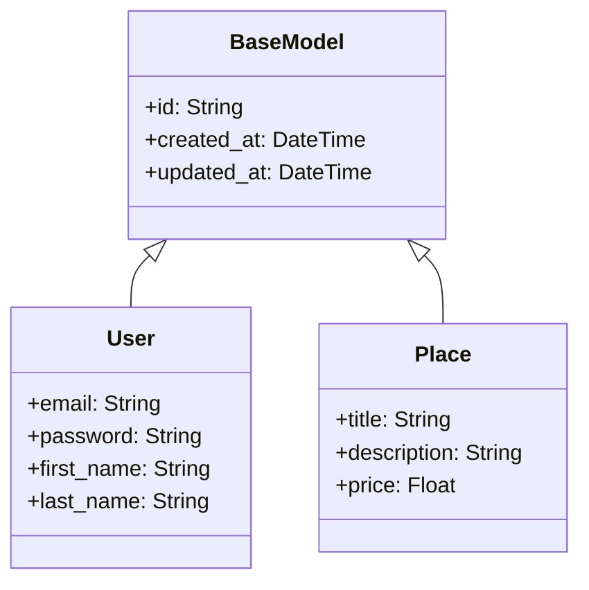

# 💻 Guide Développeur HBNB

## 📋 Table des Matières
1. [Installation Environnement](#installation-environnement)
2. [Architecture](#architecture)
3. [Base de Code](#base-de-code)
4. [Workflow de Développement](#workflow-de-développement)
5. [Debug & Troubleshooting](#debug--troubleshooting)

## 🛠 Installation Environnement

### Prérequis
```bash
# 1. Python 3.8+
python --version  # Vérification version

# 2. Node.js & npm (pour le frontend)
node --version
npm --version

# 3. MySQL
mysql --version

# 4. Redis
redis-cli --version
```

### Configuration Environnement
```bash
# 1. Cloner le projet
git clone https://github.com/your-org/hbnb.git
cd hbnb

# 2. Environnement virtuel
python -m venv venv
source venv/bin/activate  # Linux/Mac
# ou
.\venv\Scripts\activate   # Windows

# 3. Dépendances
pip install -r requirements.txt
pip install -r requirements-dev.txt

# 4. Variables d'environnement
cp .env.example .env
# Éditer .env avec vos configurations
```

## 🏗 Architecture

### Structure du Projet
```
hbnb/
├── app/
│   ├── __init__.py
│   ├── models/          # Modèles de données
│   ├── services/        # Logique métier
│   ├── api/            # Endpoints API
│   └── utils/          # Utilitaires
├── tests/
├── docs/
└── config/
```

### Diagramme de Classes


## 🔍 Base de Code

### Conventions de Code
```python
# Exemple de style PEP 8
class UserService:
    """Service gérant les opérations utilisateur."""
    
    def get_user_by_email(self, email: str) -> Optional[User]:
        """
        Récupère un utilisateur par son email.
        
        Args:
            email (str): Email de l'utilisateur
            
        Returns:
            Optional[User]: Utilisateur trouvé ou None
        """
        return User.query.filter_by(email=email).first()
```

### Patterns Courants
```python
# Pattern Repository
class UserRepository:
    def __init__(self):
        self.model = User
    
    def create(self, data: dict) -> User:
        user = self.model(**data)
        db.session.add(user)
        db.session.commit()
        return user
    
    def get_by_id(self, id: str) -> Optional[User]:
        return self.model.query.get(id)

# Pattern Service
class UserService:
    def __init__(self):
        self.repository = UserRepository()
    
    def register_user(self, data: dict) -> User:
        # Validation
        if self.repository.get_by_email(data['email']):
            raise ValidationError("Email already exists")
        
        # Hash password
        data['password'] = hash_password(data['password'])
        
        # Create user
        return self.repository.create(data)
```

## 🔄 Workflow de Développement

### Git Workflow
```bash
# 1. Créer branche feature
git checkout -b feature/nouvelle-fonctionnalite

# 2. Développement
# ... écriture du code ...

# 3. Tests
pytest tests/

# 4. Commit
git add .
git commit -m "feat: ajout nouvelle fonctionnalité"

# 5. Pull Request
git push origin feature/nouvelle-fonctionnalite
```

### Code Review
```markdown
📝 Checklist Review
├── Qualité du Code
│   ├── PEP 8
│   ├── Typage
│   └── Documentation
├── Tests
│   ├── Unitaires
│   ├── Intégration
│   └── Couverture
└── Performance
    ├── Requêtes N+1
    ├── Indexes
    └── Caching
```

## 🐛 Debug & Troubleshooting

### Logging
```python
import logging

logger = logging.getLogger(__name__)

class UserService:
    def create_user(self, data):
        try:
            user = User(**data)
            db.session.add(user)
            db.session.commit()
            logger.info(f"User created: {user.id}")
            return user
        except Exception as e:
            logger.error(f"Error creating user: {str(e)}")
            raise
```

### Debugging Tools
```python
# Flask Debug Toolbar
from flask_debugtoolbar import DebugToolbarExtension

app.config['DEBUG_TB_ENABLED'] = True
toolbar = DebugToolbarExtension(app)

# SQL Logging
app.config['SQLALCHEMY_ECHO'] = True
```

### Profiling
```python
import cProfile
import pstats

def profile_function():
    profiler = cProfile.Profile()
    profiler.enable()
    
    # Code à profiler
    result = expensive_function()
    
    profiler.disable()
    stats = pstats.Stats(profiler).sort_stats('cumtime')
    stats.print_stats()
```

## 📊 Monitoring & Métriques

### Prometheus Metrics
```python
from prometheus_flask_exporter import PrometheusMetrics

metrics = PrometheusMetrics(app)

# Custom metrics
endpoint_counter = metrics.counter(
    'endpoint_requests', 'Number of requests per endpoint'
)
```

### Health Checks
```python
@app.route('/health')
def health_check():
    checks = {
        'database': check_database(),
        'redis': check_redis(),
        'storage': check_storage()
    }
    
    status = all(checks.values())
    return jsonify({
        'status': 'healthy' if status else 'unhealthy',
        'checks': checks
    }), 200 if status else 500
```

```markdown
## 🔧 Outils de Développement

### VSCode Configuration
```json
{
    "python.pythonPath": "venv/bin/python",
    "python.linting.enabled": true,
    "python.linting.pylintEnabled": true,
    "python.formatting.provider": "black",
    "editor.formatOnSave": true,
    "python.testing.pytestEnabled": true,
    "python.testing.unittestEnabled": false,
    "python.testing.nosetestsEnabled": false,
    "python.testing.pytestArgs": [
        "tests"
    ]
}
```

### Extensions Recommandées
```markdown
📌 Extensions VSCode
├── Python
├── Pylance
├── Python Test Explorer
├── Python Docstring Generator
├── Git History
└── REST Client
```

## 📦 Gestion des Dépendances

### Requirements Files
```markdown
📁 Requirements
├── requirements.txt       # Dependencies principales
├── requirements-dev.txt   # Dependencies développement
└── requirements-prod.txt  # Dependencies production
```

### Exemple requirements-dev.txt
```txt
-r requirements.txt
pytest==7.3.1
pytest-cov==4.0.0
black==22.3.0
pylint==2.15.5
faker==15.3.2
locust==2.13.0
```

## 🗃️ Migrations Base de Données

### Commandes Alembic
```bash
# Créer une migration
flask db migrate -m "description des changements"

# Appliquer les migrations
flask db upgrade

# Annuler la dernière migration
flask db downgrade

# Voir l'historique
flask db history
```

### Exemple de Migration
```python
"""add_user_preferences_table

Revision ID: 1a2b3c4d5e6f
Revises: 9z8y7x6w5v4u
Create Date: 2024-11-14 10:00:00.000000
"""
from alembic import op
import sqlalchemy as sa

def upgrade():
    op.create_table(
        'user_preferences',
        sa.Column('id', sa.String(36), primary_key=True),
        sa.Column('user_id', sa.String(36), sa.ForeignKey('users.id')),
        sa.Column('theme', sa.String(20)),
        sa.Column('notifications_enabled', sa.Boolean(), default=True),
        sa.Column('language', sa.String(5))
    )

def downgrade():
    op.drop_table('user_preferences')
```

## 🎯 Performance Optimization

### Caching Strategy
```python
from functools import lru_cache
from flask_caching import Cache

cache = Cache(app)

# Cache en mémoire avec décorateur
@lru_cache(maxsize=128)
def get_user_stats(user_id: str) -> dict:
    # Calculs complexes...
    return stats

# Cache Redis
@cache.memoize(timeout=300)
def get_place_recommendations(user_id: str) -> list:
    return PlaceService.get_recommendations(user_id)

# Cache invalidation
def update_place(place_id: str, data: dict):
    place = Place.query.get(place_id)
    place.update(data)
    db.session.commit()
    cache.delete_memoized(get_place_recommendations)
```

### Query Optimization
```python
# Eager Loading
places = Place.query\
    .options(joinedload('owner'))\
    .options(joinedload('amenities'))\
    .filter_by(active=True)\
    .all()

# Pagination
@app.route('/api/places')
def get_places():
    page = request.args.get('page', 1, type=int)
    per_page = request.args.get('per_page', 20, type=int)
    
    places = Place.query\
        .paginate(page=page, per_page=per_page)
    
    return jsonify({
        'items': [place.to_dict() for place in places.items],
        'total': places.total,
        'pages': places.pages,
        'current_page': places.page
    })
```

## 📱 API Versioning

### Structure
```python
from flask import Blueprint

api_v1 = Blueprint('api_v1', __name__, url_prefix='/api/v1')
api_v2 = Blueprint('api_v2', __name__, url_prefix='/api/v2')

# V1 Endpoints
@api_v1.route('/places')
def get_places_v1():
    # Logique V1...
    pass

# V2 Endpoints
@api_v2.route('/places')
def get_places_v2():
    # Logique V2 améliorée...
    pass
```

## 🔐 Gestion des Secrets

### Environment Variables
```python
# config.py
import os
from dotenv import load_dotenv

load_dotenv()

class Config:
    SECRET_KEY = os.getenv('SECRET_KEY')
    DATABASE_URL = os.getenv('DATABASE_URL')
    REDIS_URL = os.getenv('REDIS_URL')
    
    @staticmethod
    def init_app(app):
        pass

class DevelopmentConfig(Config):
    DEBUG = True
    SQLALCHEMY_ECHO = True

class ProductionConfig(Config):
    DEBUG = False
    SQLALCHEMY_ECHO = False
```

## 📝 Documentation du Code

### Docstrings
```python
def process_booking(booking_id: str, user_id: str) -> dict:
    """
    Traite une réservation et met à jour tous les systèmes associés.

    Args:
        booking_id (str): L'identifiant unique de la réservation
        user_id (str): L'identifiant de l'utilisateur effectuant la réservation

    Returns:
        dict: Résultat du traitement contenant status et détails

    Raises:
        BookingNotFoundError: Si booking_id est invalide
        UserNotFoundError: Si user_id est invalide
        PaymentError: Si le paiement échoue
    
    Example:
        >>> result = process_booking("book-123", "user-456")
        >>> print(result['status'])
        'confirmed'
    """
```

## 🚨 Gestion des Erreurs

### Custom Exceptions
```python
class HBNBError(Exception):
    """Base exception pour l'application."""
    pass

class ResourceNotFoundError(HBNBError):
    """Resource non trouvée."""
    pass

class ValidationError(HBNBError):
    """Erreur de validation des données."""
    pass

class PaymentError(HBNBError):
    """Erreur lors du paiement."""
    pass
```

### Error Handlers
```python
@app.errorhandler(HBNBError)
def handle_hbnb_error(error):
    return jsonify({
        'status': 'error',
        'message': str(error),
        'code': error.__class__.__name__
    }), 400

@app.errorhandler(404)
def handle_not_found(error):
    return jsonify({
        'status': 'error',
        'message': 'Resource not found',
        'code': 'NOT_FOUND'
    }), 404
```
